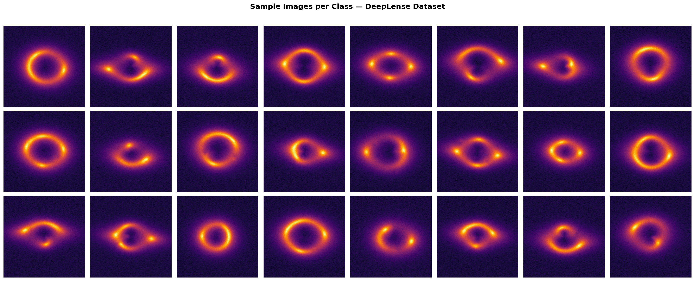
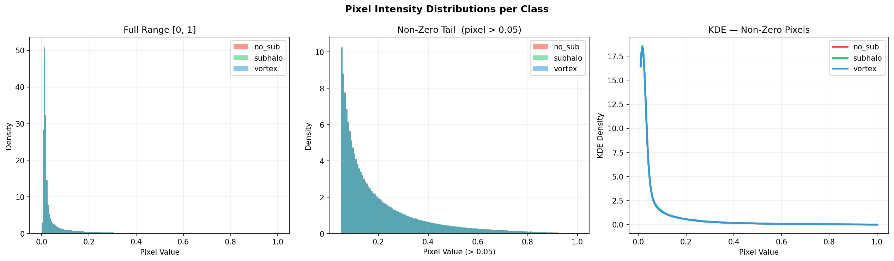
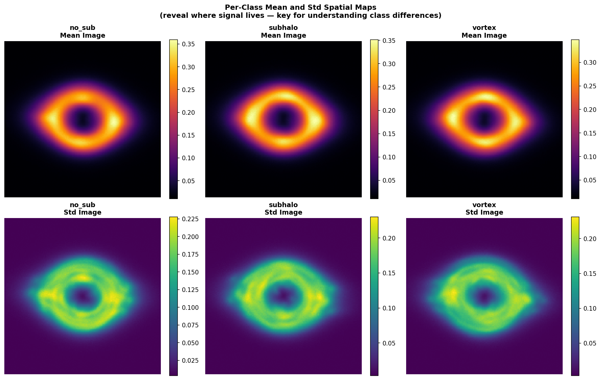
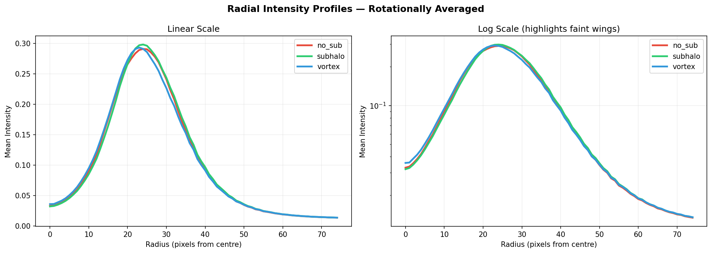
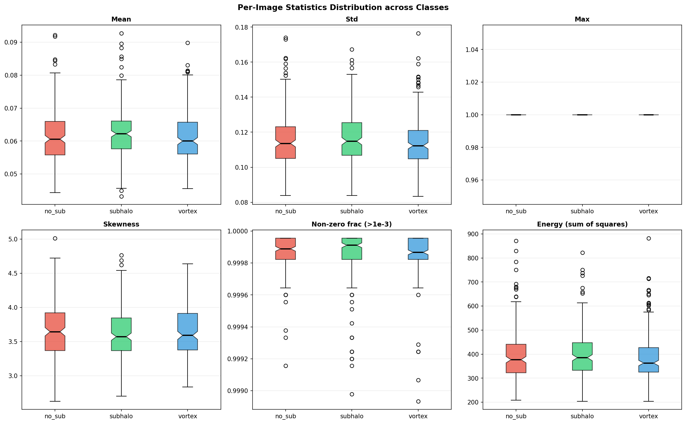
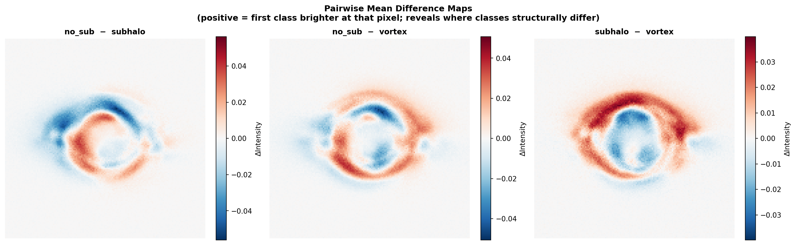
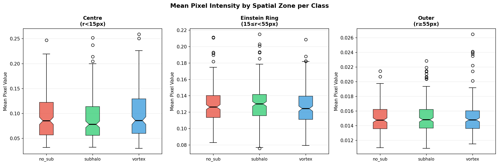
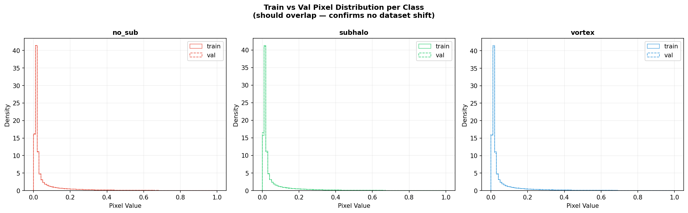
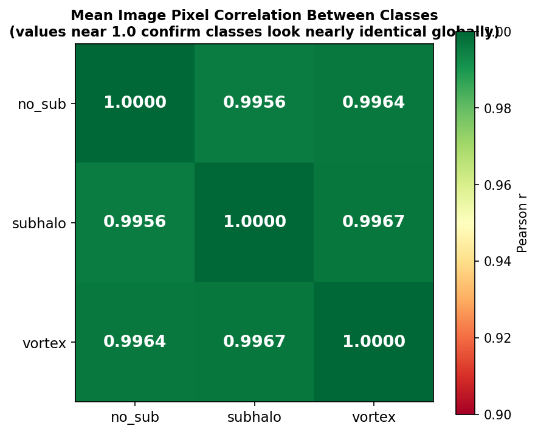

# Exploratory Data Analysis : TEST I (Multi-Class Classification)

Gravitational lensing images classified into three categories: **no_sub**, **subhalo**, and **vortex**.

---

## 1. File Inventory

| Split | Class   | Files  |
|-------|---------|--------|
| train | no_sub  | 10,000 |
| train | subhalo | 10,000 |
| train | vortex  | 10,000 |
| val   | no_sub  |  2,500 |
| val   | subhalo |  2,500 |
| val   | vortex  |  2,500 |

- **Total train:** 30,000 &nbsp;|&nbsp; **Total val:** 7,500 &nbsp;|&nbsp; **Grand total:** 37,500

---

## 2. Shape & Dtype Verification

| Split/Class    | Shape          | Dtype   | Min    | Max    |
|----------------|----------------|---------|--------|--------|
| train/no_sub   | (1, 150, 150)  | float64 | 0.0000 | 1.0000 |
| train/subhalo  | (1, 150, 150)  | float64 | 0.0000 | 1.0000 |
| train/vortex   | (1, 150, 150)  | float64 | 0.0000 | 1.0000 |
| val/no_sub     | (1, 150, 150)  | float64 | 0.0000 | 1.0000 |
| val/subhalo    | (1, 150, 150)  | float64 | 0.0000 | 1.0000 |
| val/vortex     | (1, 150, 150)  | float64 | 0.0000 | 1.0000 |

> ✅ All files have shape **(1, 150, 150)** with **float64** dtype.

---

## 3. Pixel Statistics (sampled 200 images/class from train)

| Statistic       | no_sub | subhalo | vortex |
|-----------------|--------|---------|--------|
| Mean pixel      | 0.0618 | 0.0627  | 0.0611 |
| Std pixel       | 0.1172 | 0.1180  | 0.1156 |
| Skewness        | 3.67   | 3.60    | 3.66   |
| Kurtosis        | 15.7   | 15.0    | 15.6   |
| Min             | 0.0000 | 0.0000  | 0.0000 |
| P5              | 0.0071 | 0.0071  | 0.0071 |
| Median          | 0.0173 | 0.0174  | 0.0172 |
| P95             | 0.3010 | 0.3068  | 0.2993 |
| Max             | 1.0000 | 1.0000  | 1.0000 |
| Frac near-zero  | 0.0%   | 0.0%    | 0.0%   |

---

## 4. Sample Image Grid

---

## 5. Pixel Intensity Distributions

---

## 6. Mean & Std Spatial Maps

---

## 7. Radial Intensity Profiles

---

## 8. Per-Image Statistics Distributions

---

## 9. Pairwise Mean Difference Maps

---

## 10. Zone Analysis (Centre / Einstein Ring / Outer)

**Zone pixel counts:** centre = 697 &nbsp;|&nbsp; ring = 8,768 &nbsp;|&nbsp; outer = 13,035

| Class   | Centre Mean | Ring Mean | Outer Mean |
|---------|-------------|-----------|------------|
| no_sub  | 0.0943      | 0.1287    | 0.0150     |
| subhalo | 0.0893      | 0.1311    | 0.0152     |
| vortex  | 0.0988      | 0.1264    | 0.0152     |

---

## 11. Train vs Val Distribution Check

---

## 12. Class Mean Image Correlation

| Pair                | Correlation |
|---------------------|-------------|
| no_sub ↔ subhalo    | 0.99564     |
| no_sub ↔ vortex     | 0.99643     |
| subhalo ↔ vortex    | 0.99672     |

---

## 13. Summary Table

| Metric             | no_sub | subhalo | vortex |
|--------------------|--------|---------|--------|
| Mean pixel         | 0.0618 | 0.0627  | 0.0611 |
| Std pixel          | 0.1172 | 0.1180  | 0.1156 |
| Median pixel       | 0.0173 | 0.0174  | 0.0172 |
| P95 pixel          | 0.3010 | 0.3068  | 0.2993 |
| Max pixel          | 1.0000 | 1.0000  | 1.0000 |
| Skewness           | 3.6711 | 3.5991  | 3.6563 |
| Kurtosis           | 15.678 | 14.967  | 15.581 |
| Frac near-zero (%) | 0.01   | 0.02    | 0.01   |

---

## Key Takeaways

- **Identical global statistics** : All three classes share nearly identical pixel-level stats, so classification requires learning **spatial patterns**, not raw intensity.
- **Highly correlated mean images** (r > 0.99 for every pair) : A global-pooling classifier would fail; a **spatial hierarchy** is essential.
- **Einstein ring zone is decisive** : The annular region (15 ≤ r < 55 px) exhibits the greatest inter-class variance; this is where subhalo and vortex signatures manifest.
- **Hardest pair: no_sub vs subhalo** : Subhalos produce only localised density bumps within the ring zone.
- **No dataset shift** : Train and val distributions are well-matched; the 80/20 split is reliable.
