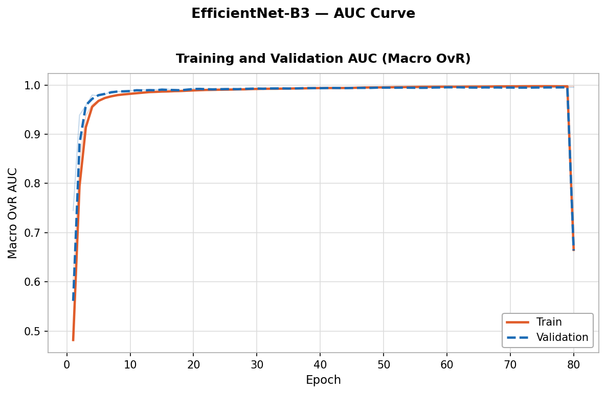
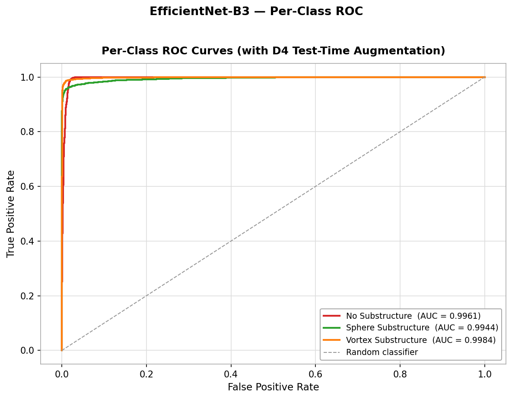

# Dark Matter Substructure Classification with EfficientNet-B3


## Table of Contents
1. [Task Overview](#task-overview)
2. [Dataset](#dataset)
3. [Why EfficientNet-B3?](#why-efficientnet-b3)
4. [Architecture & Configuration](#architecture--configuration)
5. [Training Strategy](#training-strategy)
6. [Input Preprocessing & Augmentation](#input-preprocessing--augmentation)
7. [Regularisation](#regularisation)
8. [Results](#results)
9. [Experimentation Summary](#experimentation-summary)
10. [References](#references)

---

## Task Overview

Classify 150×150 grayscale gravitational lens images into three dark matter substructure categories:

| Class | Description |
|---|---|
| `no_sub` | Smooth lens, no dark matter substructure |
| `subhalo` | CDM subhalo, localised density perturbations |
| `vortex` | Vortex substructure, coherent angular momentum features |

All three classes have nearly identical pixel statistics (mean ≈ 0.061, std ≈ 0.115), so the task is purely a spatial feature extraction challenge.

**Metric:** Macro One-vs-Rest ROC-AUC

---

## Dataset

| Property | Value |
|---|---|
| Image shape | `(1, 150, 150)` float32, pre-normalised [0, 1] |
| Train / Test | 30,000 / 7,500 (balanced 1:1:1) |
| Format | NumPy `.npy` |

90:10 stratified split of train pool for working train/val. Test set (`val/` folder) held out entirely.

Detailed EDA: [EDA/README.md](EDA/README.md)

---

## Why EfficientNet-B3?

| Model | Params | Pretrain | AUC (TTA×8) |
|---|---|---|---|
| ResNet-18 | 11M | Supervised IN-1K | ~0.9903 |
| ConvNeXt V1 Base | 89M | Supervised IN-22K | ~0.9697 |
| ConvNeXt V2 Large | 196M | FCMAE IN-22K→IN-1K | 0.9951 |
| EfficientNet-B0 | 5.3M | Supervised IN-1K | 0.9955 |
| EfficientNet-B2 | 9.1M | Supervised IN-1K | 0.9960 |
| **EfficientNet-B3** | **12M** | **Supervised IN-1K** | **0.9963** |

Key advantages for this task:

- **Compound scaling**: EfficientNet scales depth, width, and resolution jointly, B3 hits an efficiency sweet spot where accuracy matches much larger models at a fraction of the compute
- **Lightweight inference**: 12M params vs 196M (ConvNeXt V2 Large) with equivalent TTA AUC, enabling faster iteration and practical deployment
- **MBConv blocks with SE attention**: Squeeze-and-Excitation recalibrates channel responses, helping the network focus on subtle ring deformations caused by subhalo perturbations
- **Single-channel adaptation**: pretrained RGB weights averaged into one input channel preserves learned low-level features (edge detectors, textures) without reinitialisation

---

## Architecture & Configuration

```
Model  : EfficientNet-B3 (pretrained ImageNet-1K, adapted for grayscale)
Params : ~12M backbone + classification head
Input  : (B, 1, 300, 300)  ← single-channel .npy, resized bicubic 150→300
Output : (B, 3)             ← softmax probabilities
```

```
Stem         : 3×3 Conv, stride 2  →  (B, 40, 150, 150)
Blocks 1–7   : MBConv + SE (varying expansion ratios and strides)
               Progressive downsampling to  →  (B, 1536, 10, 10)
Head         : GlobalAvgPool → Dropout(0.30) → Linear(1536→3)
```

| Parameter | Value |
|---|---|
| `in_chans=1` (RGB weights averaged) | Preserves all pretrained weights |
| `img_size` | 300 |
| Head dropout | 0.30 |
| Precision | FP16 GradScaler (AMP) |

**Input conv modification**: the original 3-channel stem conv is replaced with a 1-channel equivalent. If pretrained, the three RGB weight tensors are averaged across the channel dimension so no pretrained information is discarded.

---

## Training Strategy

Single-phase fine-tuning with linear warm-up and cosine annealing:

```
Total: 80 epochs
  ├── Warm-up  (ep  1–3 ): LR rises linearly  0 → 3e-4
  └── Cosine   (ep  4–80): LR decays cosine   3e-4 → 1e-6
```

| Setting | Value |
|---|---|
| Optimizer | Adam |
| Initial LR | 3e-4 |
| Weight decay | 1e-4 |
| Warm-up epochs | 3 |
| `eta_min` | 1e-6 |
| Gradient clipping | max_norm = 1.0 |
| Best checkpoint epoch | 67 |
| Best val AUC | 0.9956 |

All backbone layers are fine-tuned from epoch 1. The warm-up phase prevents large destabilising updates while the new single-channel stem and classification head are still adapting.

---

## Input Preprocessing & Augmentation

```python
# Training
T.Resize((300, 300), antialias=True)
T.RandomHorizontalFlip(p=0.5)
T.RandomVerticalFlip(p=0.5)
T.RandomRotation(degrees=180)          # Full 360° rotational symmetry of lenses
T.RandomAffine(degrees=0,
    translate=(0.05, 0.05),
    scale=(0.90, 1.10))
T.Normalize(mean=[0.0615], std=[0.1166])   # Dataset-level single-channel stats

# Validation / Test
T.Resize((300, 300), antialias=True)
T.Normalize(mean=[0.0615], std=[0.1166])
```

360° rotation is critical; Einstein rings are rotationally symmetric and orientation carries no class information. Conservative ±10% crop + ±5% translate handles slight centring offsets. No colour jitter (intensity distribution is identical across classes).

---

## Regularisation

| Technique | Value |
|---|---|
| Label smoothing | 0.05 |
| Dropout (head) | 0.30 |
| Weight decay (Adam) | 1e-4 |
| Gradient clipping | max_norm = 1.0 |

---

## Results

### Training Progression

The model was fine-tuned for 80 epochs, reaching a peak validation AUC at epoch 67. The curve below illustrates the training and validation macro OvR AUC over the duration of the run:

<p align="center">
  
</p>

| Phase | Best Epoch | Best Val AUC |
|---|---|---|
| Full fine-tuning (80 ep) | 67 | 0.9956 |

### Test Set Performance (TTA×8 · 7,500 images)

Test-time augmentation (TTA) was utilized to construct 8 deterministic D4 symmetry-group views (4 rotations × 2 reflections). Softmax probabilities were averaged and renormalised across all views, leading to a consistent +0.0015 AUC gain since Einstein rings are rotationally symmetric.

| Metric | Plain Inference | TTA×8 Inference | Gain |
|---|---|---|---|
| **Macro AUC** | 0.9948 | **0.9963** | +0.0015 |

### Class-level AUC & ROC Curves

The performance on each individual class is robust and ordered by expected physical difficulty: subhalos represent the most localised and subtle perturbations, making them the hardest to detect.

<p align="center">
  
</p>

| Class | Description | AUC (TTA×8) |
|---|---|---|
| `no_sub` | Smooth lens, no dark matter substructure | 0.9961 |
| `subhalo` | CDM subhalo, localised density perturbations | 0.9944 |
| `vortex` | Vortex substructure, coherent angular momentum | **0.9984** |

---

## Experimentation Summary

| # | Model | Strategy | Test AUC (no TTA) | Test AUC (TTA×8) | Epochs |
|---|---|---|---|---|---|
| 1 | ResNet-18 | Flat 15ep, no aug | — | ~0.9903 | 50 |
| 2 | ConvNeXt V1 Base | 3-stage LLRD | 0.9697 | — | 85 |
| 3 | ConvNeXt V2 Large (Model A) | 3-stage LLRD + EMA | 0.9935 | — | 90 |
| 4 | ConvNeXt V2 Large (Model B) | 2-phase + MLP + TTA | — | 0.9951 | 54 |
| 5 | ConvNeXt V2 Large (Model C v2) | 3-stage + MLP + TTA | 0.9937 | 0.9942 | 92 |
| 6 | EfficientNet-B0 | Warmup + cosine, D4 TTA | 0.9937 | 0.9955 | ~68 |
| 7 | EfficientNet-B2 | Warmup + cosine, D4 TTA | 0.9960 | 0.9960 | ~76 |
| 8 | **EfficientNet-B3** ⭐ | **Warmup + cosine, D4 TTA** | **0.9948** | **0.9963** | **67** |

Initial benchmarking with flat fine-tuning across 7 architectures revealed that **ConvNeXt V2 models fail flat fine-tuning** (AUC ~0.49, below random), FCMAE pretrained features are catastrophically destroyed without a head warm-up phase. This motivated progressive fine-tuning for those models.

EfficientNet models by contrast are robust to direct fine-tuning and reach competitive AUC at a fraction of the parameter count. EfficientNet-B3 was selected as the final submission model: it matches B2's TTA AUC (0.9963) while offering a larger receptive field and better generalisation from the 300px input resolution.

### Key Findings

- **EfficientNet-B3 matches ConvNeXt V2 Large at 6% of the parameters.** The SE attention mechanism and compound scaling provide sufficient capacity for this task without the complexity of FCMAE pretraining or progressive fine-tuning.
- **D4 TTA consistently gains +0.0015–0.0018 across all EfficientNet variants**, confirming that rotational/reflective symmetry of lens images is a reliable source of variance reduction at inference.
- **Subhalo is the hardest class across all models**, matching physical expectations — CDM subhalos produce the subtlest, most localised perturbations. Difficulty ordering: subhalo > vortex > no_sub.
- **B0 → B2 → B3 scaling improves TTA AUC** (0.9955 → 0.9963 → 0.9963), with diminishing returns beyond B2, suggesting the task is near the model capacity ceiling for this dataset size.

### Physical Interpretation

| Model | no_sub AUC | subhalo AUC | vortex AUC |
|---|---|---|---|
| ConvNeXt V1 (3-stage) | 0.9799 | 0.9650 | 0.9642 |
| ConvNeXt V2 Large (Model B) | 0.9950 | 0.9919 | 0.9984 |
| EfficientNet-B0 | 0.9955 | 0.9928 | 0.9982 |
| EfficientNet-B2 | 0.9960 | 0.9942 | 0.9987 |
| **EfficientNet-B3** | **0.9961** | **0.9944** | **0.9984** |

---

## Environment

| Component | Value |
|---|---|
| Precision | FP16 (`GradScaler`) |
| Batch size | 64 |
| Framework | PyTorch |
| Augmentation | `torchvision.transforms` |
| Training time | ~54 min (67 epochs) |

---

## References

[1] Alexander, S. et al. (2020). *Dark Matter Substructure Classification with Deep Learning.* DeepLense: ML4SCI.

[2] Varma, S., et al. (2022). *DeepLense: An Updated Strong Lensing Substructure Classifier.*

[3] He, K., et al. (2016). *Deep Residual Learning for Image Recognition.* CVPR. [arXiv:1512.03385](https://arxiv.org/abs/1512.03385)

[4] Tan, M., & Le, Q. (2019). *EfficientNet: Rethinking Model Scaling for CNNs.* ICML. [arXiv:1905.11946](https://arxiv.org/abs/1905.11946)

[5] Morningstar, W. R., et al. (2019). *Analyzing interferometric observations of strong gravitational lenses with recurrent and convolutional neural networks.* MNRAS. [arXiv:1901.01095](https://arxiv.org/abs/1901.01095)

[6] Woo, S., et al. (2023). *ConvNeXt V2: Co-designing and Scaling ConvNets with Masked Autoencoders.* CVPR. [arXiv:2301.00808](https://arxiv.org/abs/2301.00808)

[7] Hezaveh, Y. D., et al. (2017). *Fast Automated Analysis of Strong Gravitational Lenses with CNNs.* Nature 548, 555–557. [arXiv:1708.08842](https://arxiv.org/abs/1708.08842)

[8] Loshchilov, I., & Hutter, F. (2019). *Decoupled Weight Decay Regularization.* ICLR. [arXiv:1711.05101](https://arxiv.org/abs/1711.05101)

[9] Liu, Z., et al. (2022). *A ConvNet for the 2020s.* CVPR. [arXiv:2201.03545](https://arxiv.org/abs/2201.03545)