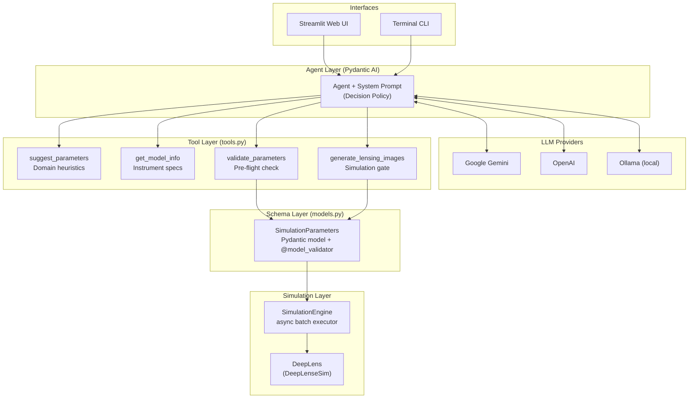
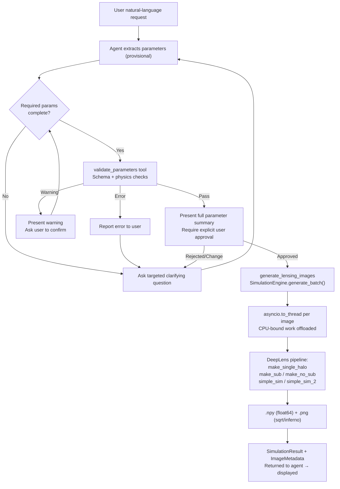

### Common Test I : Multi-Class Classification

**Task:** Classify 150×150 grayscale gravitational lens images into three dark matter substructure categories (`no_sub`, `subhalo`, `vortex`).

| | |
|---|---|
| Model | EfficientNet-B3 (12M params) |
| Strategy | Single-phase fine-tuning with cosine annealing (67 epochs), TTA×8 |
| **Test AUC** | **0.9963** (macro One-vs-Rest, TTA×8) |

📄 **[Detailed README →](Common%20Test/README.md)** · 📓 **[Notebook →](Common%20Test/notebooks/Common_Task%28EfficientNet-B3%29.ipynb)**

---

# Agentic Workflow for DeepLenseSim

A **schema-first agentic system** built on [Pydantic AI](https://ai.pydantic.dev/) that wraps the [DeepLenseSim](https://github.com/mwt5345/DeepLenseSim) pipeline. The agent translates underspecified natural-language requests into verified, physics-consistent gravitational lensing simulations through iterative clarification, schema validation, and explicit human confirmation.

---

## Design Rationale

Most LLM-driven pipelines pass user text directly to execution. This system treats that as a correctness risk.

Gravitational lensing simulations are:
- **Computationally expensive** (seconds to minutes per batch)
- **Physics-constrained** (e.g., source must be behind the lens)
- **Scientifically sensitive** (wrong redshifts or masses produce physically meaningless outputs)

**Therefore:**

> The LLM is restricted to parameter extraction and decision-making. All execution paths are gated by Pydantic schema validation and explicit user confirmation. Invalid scientific configurations cannot reach the simulation engine.

**Why agent over a structured form?**

| | Form UI | This Agent |
|---|---|---|
| Underspecified input | Requires full form completion | Asks targeted clarifying questions |
| Iterative refinement | Requires resubmission | Conversational correction in-place |
| Physics guidance | Static help text | `suggest_parameters` tool with domain heuristics |
| Model comparison | Static docs | `get_model_info` on demand |
| Adaptation | None | Interprets intent, maps to schema |

**Why not fully autonomous?**

Fully autonomous execution is intentionally avoided. The confirmation gate before simulation is a design choice, not a limitation. It prevents propagation of hallucinated parameter values into expensive compute, and gives domain users control over scientific configuration.

---

## Agent Decision Policy

The agent follows a deterministic decision policy encoded in the system prompt. Every simulation request passes through these stages in order:

```
1. PARSE       Extract parameters from user input (provisional, not trusted)
2. ELICIT      For each missing required parameter, ask a targeted question
3. SUGGEST     If user is unsure, invoke suggest_parameters (no side effects)
4. COMPARE     If user asks about models, invoke get_model_info (no side effects)
5. VALIDATE    Invoke validate_parameters: schema check + physics constraint check
                  On error  → report to user, return to ELICIT
                  On warning → present warning, ask user to confirm or adjust
6. CONFIRM     Present full parameter summary, request explicit user approval
                  On rejection / change → return to ELICIT
7. EXECUTE     Only after explicit approval: invoke generate_lensing_images
```

All extracted parameters are treated as provisional until Step 5 validates them against the Pydantic schema. The LLM cannot bypass Steps 5 or 6.

The agent can re-enter the loop at any point. If validation fails after user confirms, it reports the error and returns to Step 2. This is not a linear pipeline -- it is a control loop.

---

## Architecture



### Data Flow



---

## Failure Handling

| Failure Mode | Handling |
|---|---|
| Missing required parameter | Agent asks targeted clarifying question; loop continues |
| Invalid enum value (model/substructure) | `validate_parameters` returns error; user is prompted to correct |
| `z_source <= z_halo` | Caught by Pydantic `@model_validator` before reaching the engine |
| Out-of-range halo mass | Warning issued; user asked to confirm before proceeding |
| Missing axion mass | Auto-drawn from `[1e-24, 1e-22] eV` uniform log prior; user informed |
| User corrects parameters mid-flow | Agent re-validates; does not re-execute unless re-confirmed |
| Simulation engine error | Error surfaced in `SimulationResult.message`; partial batches reported |
| LLM API quota exceeded | `KeyRotator` rotates to next key in pool; agent re-initialized |

**Example -- invalid redshift:**
```
User:  Generate CDM images with z_halo=1.5, z_source=0.8
Agent: Physics check failed: source redshift (0.8) must exceed lens redshift (1.5).
       Would you like to swap them, or specify different values?
```

**Example -- missing parameters:**
```
User:  Generate lensing images
Agent: Which model configuration: Model_I (150x150 px, Gaussian PSF),
       Model_II (64x64 px, Euclid VIS), or Model_III (64x64 px, HST ACS/WFC)?
```

**Example -- user correction flow:**
```
User:  Actually, use 20 images not 5
Agent: Updated. Revised summary: 20 CDM images, Model_I, z_halo=0.5, z_source=1.0
       Shall I proceed?
```

---

## Tools

| Tool | Role | Side Effects | Called By Policy Step |
|------|------|-------------|----------------------|
| `suggest_parameters` | Physics-based heuristics for 6 scientific scenarios | None | 3 (SUGGEST) |
| `get_model_info` | Returns instrument/resolution specs for one or all models | None | 4 (COMPARE) |
| `validate_parameters` | Schema validation + physics checks, returns errors/warnings | None | 5 (VALIDATE) |
| `generate_lensing_images` | Executes the simulation batch | Writes `.npy` and `.png` to `outputs/` | 7 (EXECUTE) |

### Model Intelligence: Adaptive Recommendations

The agent does not treat models as static options. Example behaviors:

- If user mentions **"quick experiment"** or **"lower compute"** the agent notes Model_II or Model_III (64x64) is faster per image
- If user mentions **"Euclid-like"** the agent recommends Model_II and explains the instrument
- If user mentions **"HST"** the agent recommends Model_III (ACS/WFC F814W, 0.05 arcsec/px)
- If user mentions **"high resolution"** the agent recommends Model_I (150x150, 0.05 arcsec/px)
- For axion simulations without a specified mass, the agent states the auto-drawn value before confirming

### `suggest_parameters` -- Scientific Scenarios

| Scenario | Physical Setup | Key Suggestions |
|----------|---------------|-----------------|
| `galaxy_scale` | Milky Way-mass lens | halo_mass=1e12, z_halo=0.5, z_source=1.5 |
| `cluster_scale` | Galaxy cluster as lens | halo_mass=5e14, z_halo=0.3, z_source=2.0 |
| `high_redshift` | Euclid deep-field source | z_source=3.0, Model_II |
| `low_mass_axion` | Ultra-light fuzzy DM, large vortex cores | axion_mass=1e-24 eV |
| `high_mass_axion` | Heavy axion, compact cores near CDM regime | axion_mass=1e-22 eV |
| `statistical_study` | ML training batch | num_images=50 |

---

## Supported Configurations

### Model Configurations

| Property | Model_I | Model_II | Model_III |
|----------|---------|---------|-----------|
| Resolution | 150x150 px | 64x64 px | 64x64 px |
| Pixel Scale | 0.05 arcsec/px | 0.101 arcsec/px | 0.05 arcsec/px |
| Instrument | Gaussian PSF (FWHM=0.087") | Euclid VIS (6-year coadd) | HST ACS/WFC F814W |
| Source Light | Sersic (amplitude-based) | Sersic (magnitude-based) | Sersic (magnitude-based) |
| CDM Sampler | pyHalo | pyHalo | make_old_cdm (power-law SHMD) |
| Use When | High-res, original setup | Euclid-like survey science | HST-like, older CDM prior |

### Dark Matter Substructure

| Type | Description | Required Extra Parameters |
|------|------------|--------------------------|
| `no_sub` | Smooth SIE lens only | None |
| `axion` | Ultra-light axion vortex (de Broglie-scale cores) | `axion_mass` (eV), `vortex_mass` (M_sun) |
| `cdm` | Point-mass subhalos from sub-halo mass distribution | None |

### Simulation Parameters

| Parameter | Default | Range | Notes |
|-----------|---------|-------|-------|
| `num_images` | 1 | 1--100 | Batch size |
| `halo_mass` | 1e12 M_sun | >0 | Main SIE lens mass |
| `z_halo` | 0.5 | 0.1--2.0 | Lens redshift |
| `z_source` | 1.0 | 0.1--5.0 | Must exceed `z_halo` |
| `axion_mass` | auto | 1e-24--1e-22 eV | Auto-drawn if omitted for axion sims |
| `vortex_mass` | 3e10 M_sun | >0 | Total axion vortex mass |
| `random_seed` | None | any int | Set for reproducibility |

---

## Evaluation Approach

The system is designed for measurable evaluation across these dimensions:

| Metric | What It Measures |
|--------|-----------------|
| **Parameter correctness rate** | Fraction of sessions where final submitted params match user intent (human-judged) |
| **Clarification turns per session** | Mean number of back-and-forth exchanges before confirmation; lower is better for clear inputs |
| **Validation catch rate** | Fraction of physically invalid configurations caught before simulation (target: 100%) |
| **Simulation success rate** | Fraction of confirmed executions that produce valid image output |
| **Time to valid simulation** | Wall-clock time from first message to simulation complete |

The HITL loop directly improves the first two: by asking targeted questions it reduces invalid submissions at the confirmation gate compared to a fully autonomous pipeline.

---

## Module Overview

| Module | Responsibility |
|--------|---------------|
| `src/config.py` | Physical constants, model specs, `AgentDependencies` dataclass, `KeyRotator` |
| `src/models.py` | Pydantic input/output models; `@model_validator` for physics constraints |
| `src/tools.py` | Four async tool functions forming the agent's action space |
| `src/agent.py` | Agent factory, system prompt (decision policy), CLI runner |
| `src/simulation_engine.py` | Async DeepLenseSim wrapper; `asyncio.to_thread` per image |
| `app.py` | Streamlit web UI (model selector, key rotation, agent reasoning panel) |

---

## Installation

```bash
# 1. Install pyHalo
git clone https://github.com/dangilman/pyHalo.git
cd pyHalo && python setup.py develop && cd ..

# 2. Install DeepLenseSim
cd DeepLenseSim && python setup.py install && cd ..

# 3. Install Python dependencies
pip install -r requirements.txt

# 4. Configure LLM
cp .env.example .env   # then fill in your API key
```

**LLM provider auto-detection (priority order):**

```
GEMINI_API_KEY set  →  google-gla:gemini-2.0-flash   (recommended, free tier)
OPENAI_API_KEY set  →  openai:gpt-4o-mini
neither set         →  ollama:llama3.2  (fully local, no key required)
LENSING_AGENT_MODEL →  overrides all of the above
```

**API key rotation (quota resilience):** Set `GEMINI_API_KEY`, `GEMINI_API_KEY_2`, `GEMINI_API_KEY_3`, ... to rotate automatically on quota errors.

---

## Usage

```bash
# Web UI
LENSING_AGENT_MODEL="google-gla:gemini-flash-latest" streamlit run app.py

# Terminal CLI
python -m src.agent
```

---

## Tests

```bash
pytest tests/ -v   # 48 tests
```

| Test Module | Coverage |
|-------------|---------|
| `test_models.py` | Pydantic validation, physics constraints, enum correctness |
| `test_tools.py` | Tool behavior (simulation engine mocked); includes all 6 suggest_parameters scenarios |
| `test_agent.py` | Agent creation, system prompt content, tool registration |

---

## License

MIT (follows DeepLenseSim)
