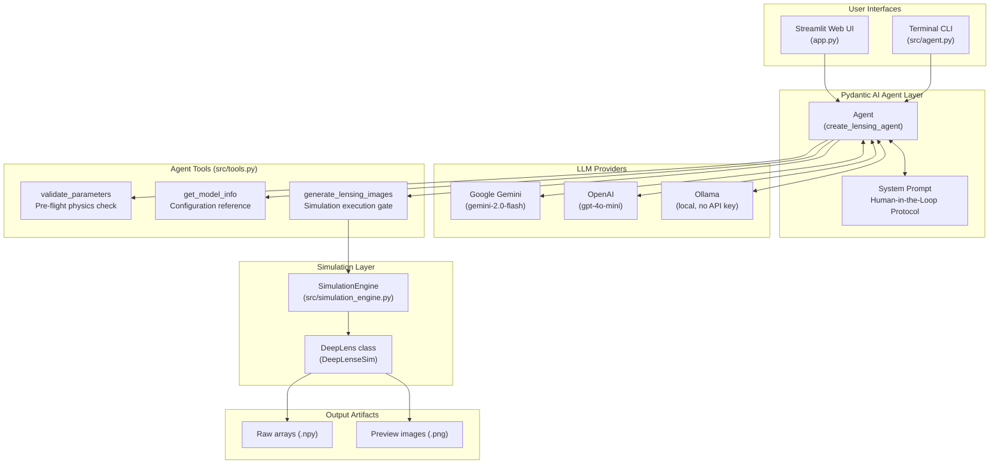
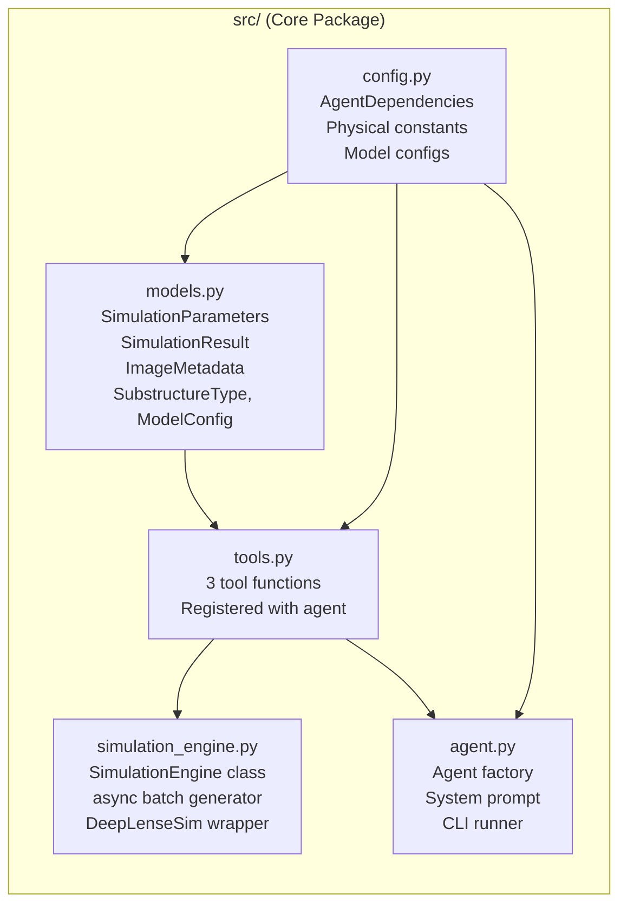
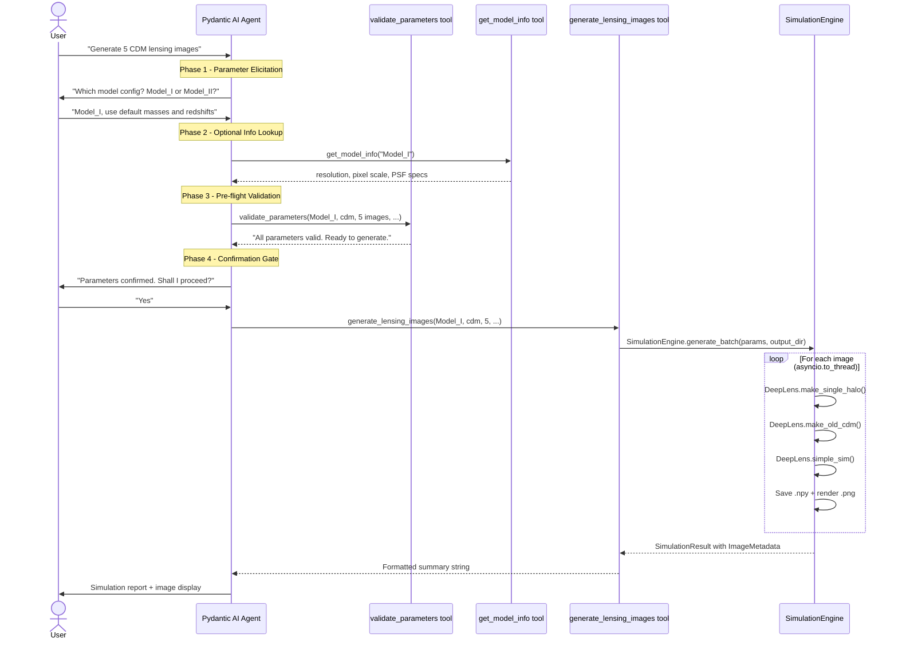
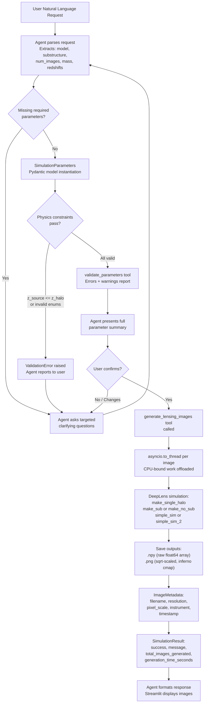

# Agentic Workflow for DeepLenseSim

An agentic workflow built on **Pydantic AI** that wraps the [DeepLenseSim](https://github.com/mwt5345/DeepLenseSim) simulation pipeline to generate scientifically accurate strong gravitational lensing images through **natural language interaction**.

## Table of Contents

1. [Overview](#overview)
2. [High-Level Architecture](#high-level-architecture)
3. [Component Architecture](#component-architecture)
4. [Human-in-the-Loop Flow](#human-in-the-loop-flow)
5. [Data Flow Diagram](#data-flow-diagram)
6. [Project Structure](#project-structure)
7. [Module Descriptions](#module-descriptions)
8. [Agent Tools](#agent-tools)
9. [Supported Configurations](#supported-configurations)
10. [Installation](#installation)
11. [Usage](#usage)
12. [Running Tests](#running-tests)

---

## Overview

The DeepLense AI Agent translates plain-English simulation requests into verified, physics-consistent lensing simulations. The agent enforces a strict human-in-the-loop protocol, ensuring every parameter is confirmed before any computationally expensive simulation begins.

**Core capabilities:**

- Natural language interface for describing simulations
- Multi-turn conversation with clarifying questions for missing parameters
- Physics-level parameter validation (redshift ordering, mass ranges, axion constraints)
- Two telescope/instrument configurations (Model_I and Model_II)
- Three dark matter substructure classes (no_sub, axion, CDM)
- Multi-provider LLM support (Google Gemini, OpenAI, Ollama/local)
- Streamlit web UI and interactive terminal CLI

---

## High-Level Architecture



---

## Component Architecture



Each module has a single, well-defined responsibility:

| Module | Responsibility |
|--------|---------------|
| `config.py` | All constants, defaults, and the injectable `AgentDependencies` dataclass |
| `models.py` | Pydantic models that enforce physics validity at the data layer |
| `tools.py` | Three async tool functions that form the agent's action space |
| `agent.py` | Agent factory, system prompt definition, and CLI entry point |
| `simulation_engine.py` | Wraps the `DeepLens` class and manages async batch image generation |

---

## Human-in-the-Loop Flow

The system prompt enforces a four-phase interaction pattern before any simulation runs.



---

## Data Flow Diagram



---

## Project Structure

```
.
├── src/
│   ├── __init__.py
│   ├── agent.py               # Agent definition, system prompt, CLI runner
│   ├── config.py              # AgentDependencies, physical constants, model specs
│   ├── models.py              # Pydantic models for params, results, and enums
│   ├── simulation_engine.py   # Async DeepLenseSim wrapper (batch generation)
│   └── tools.py               # 3 tool functions: generate, info, validate
├── tests/
│   ├── __init__.py
│   ├── test_agent.py          # Agent creation and system prompt tests
│   ├── test_models.py         # Pydantic model validation and physics tests
│   └── test_tools.py          # Tool function tests (simulation engine mocked)
├── examples/
│   ├── demo_conversation.py   # Multi-turn conversation demo
│   └── batch_generation.py    # Programmatic batch usage without LLM
├── DeepLenseSim/              # Cloned DeepLenseSim repository
│   ├── Model_I/               # 150x150 px, Gaussian PSF configuration
│   ├── Model_II/              # 64x64 px, Euclid VIS configuration
│   ├── Model_III/
│   ├── Model_IV/
│   └── deeplense/             # Core DeepLens class
├── outputs/                   # Generated .npy and .png simulation outputs
├── app.py                     # Streamlit web UI
├── pyproject.toml
└── requirements.txt
```

---

## Module Descriptions

### `src/config.py` - Configuration and Dependencies

Defines all physical constants and model-specific parameters as module-level constants, and the `AgentDependencies` dataclass that is injected into every tool call via Pydantic AI's `RunContext`.

```
AgentDependencies
  output_dir: str       # Path to outputs directory (default: ./outputs)
  ensure_output_dir()   # Creates the directory if it does not exist
```

Key constants defined here:

| Constant | Value | Description |
|----------|-------|-------------|
| `MODEL_I_RESOLUTION` | (150, 150) | Pixel dimensions for Model_I |
| `MODEL_I_PIXEL_SCALE` | 0.05 arcsec/px | Angular resolution for Model_I |
| `MODEL_II_RESOLUTION` | (64, 64) | Pixel dimensions for Model_II |
| `MODEL_II_PIXEL_SCALE` | 0.101 arcsec/px | Euclid VIS angular resolution |
| `MAX_IMAGES_PER_REQUEST` | 100 | Hard cap on batch size |

---

### `src/models.py` - Pydantic Data Models

All simulation inputs and outputs are fully typed. Physics validation happens at the data layer, independent of the LLM.

**Enumerations:**

```python
class SubstructureType(str, Enum):
    NO_SUB = "no_sub"   # Smooth lens, no dark matter substructure
    AXION  = "axion"    # Axion vortex substructure
    CDM    = "cdm"      # Cold dark matter point-mass subhalos

class ModelConfig(str, Enum):
    MODEL_I  = "Model_I"   # 150x150 px, Gaussian PSF
    MODEL_II = "Model_II"  # 64x64 px, Euclid VIS SimAPI
```

**`SimulationParameters`** (input model):

| Field | Type | Default | Constraint |
|-------|------|---------|------------|
| `model_config_type` | `ModelConfig` | required | Model_I or Model_II |
| `substructure_type` | `SubstructureType` | required | no_sub, axion, cdm |
| `num_images` | `int` | 1 | 1 to 100 |
| `halo_mass` | `float` | 1e12 | > 0 (solar masses) |
| `z_halo` | `float` | 0.5 | 0.1 to 2.0 |
| `z_source` | `float` | 1.0 | 0.1 to 5.0; must exceed z_halo |
| `axion_mass` | `float or None` | None | auto-drawn if axion substructure |
| `vortex_mass` | `float` | 3e10 | > 0 (solar masses) |
| `random_seed` | `int or None` | None | any integer for reproducibility |

A `@model_validator` enforces that `z_source > z_halo` and auto-populates `axion_mass` in `[1e-24, 1e-22] eV` when running axion simulations without a specified mass.

**`SimulationResult`** (output model): Contains `success`, `message`, `parameters_used`, `images` (list of `ImageMetadata`), `total_images_generated`, `output_directory`, and `generation_time_seconds`.

---

### `src/tools.py` - Agent Tool Functions

Three async functions registered with the Pydantic AI agent. Each receives a `RunContext[AgentDependencies]` as its first argument.

#### `generate_lensing_images`

The primary execution tool. Called only after user confirmation.

```
Inputs:  model_config_type, substructure_type, num_images, halo_mass,
         z_halo, z_source, axion_mass, vortex_mass, random_seed
Process: Builds SimulationParameters -> calls SimulationEngine.generate_batch()
Output:  Formatted Markdown string with simulation results and file paths
```

#### `get_model_info`

Informational tool that returns telescope/instrument specs for one or both models. Stateless and has no side effects. Useful when the user asks to compare Model_I and Model_II before choosing.

#### `validate_parameters`

Pre-flight validation tool. Can be called before `generate_lensing_images` to surface errors and warnings. Issues reported include:

- Invalid enum values for model or substructure type
- Source redshift behind or equal to lens redshift
- Halo mass below 1e8 or above 1e15 solar masses
- Out-of-range axion mass (outside typical `[1e-24, 1e-22] eV`)
- Missing axion mass for axion simulations
- Large batch size time estimate (> 50 images)

---

### `src/simulation_engine.py` - DeepLenseSim Wrapper

The `SimulationEngine` class bridges the agent and the DeepLenseSim library.

**`generate_batch` (async class method):**

Iterates over `num_images` and offloads each simulation to a thread pool via `asyncio.to_thread()`, keeping the async event loop responsive while lenstronomy (CPU-bound) executes in a worker thread.

**`_run_single_simulation` (static method):**

Executed inside the thread pool worker. Follows this sequence for each image:

```
1. Set numpy random seed (params.random_seed + image_index)
2. Instantiate DeepLens(H0, Om0, Ob0, z_halo, z_gal)
3. lens.make_single_halo(halo_mass)
4. Substructure:
     no_sub  -> lens.make_no_sub()
     axion   -> lens.make_vortex(vortex_mass)
     cdm     -> lens.make_old_cdm()
5. Source and simulation:
     Model_I  -> lens.make_source_light(); lens.simple_sim()
     Model_II -> lens.set_instrument("euclid"); lens.make_source_light_mag(); lens.simple_sim_2()
6. Extract image_real array (fallback to image attribute)
7. Save as .npy (raw float64)
8. Render .png with sqrt scaling and inferno colormap
9. Return ImageMetadata
```

---

### `src/agent.py` - Agent Factory and System Prompt

**`create_lensing_agent(model_name, deps)`**: Factory function that:

1. Resolves the LLM provider (auto-detects or uses `LENSING_AGENT_MODEL` env var)
2. For Ollama: wraps `OpenAIChatModel` with `OllamaProvider` to ensure reliable tool call support
3. Constructs the `Agent` with the system prompt, `AgentDependencies` type, and `retries=2`
4. Registers all three tool functions

**LLM auto-detection priority:**

```
GEMINI_API_KEY set  ->  google-gla:gemini-2.0-flash
OPENAI_API_KEY set  ->  openai:gpt-4o-mini
neither set         ->  ollama:llama3.2  (fully local)
```

**Local LLM fallback (CLI mode):** Small local models (under 8B parameters) sometimes output raw JSON instead of structured function calls. The CLI runner detects this pattern, parses the JSON, and invokes `generate_lensing_images` directly.

---

### `app.py` - Streamlit Web UI

A custom dark-themed chat interface with animated SVG avatars. Key implementation details:

- All default Streamlit chrome (toolbar, footer, header) is hidden via CSS
- A persistent `asyncio` event loop is stored in `st.session_state` to bridge Streamlit's synchronous model with the async Pydantic AI agent (`loop.run_until_complete(agent.run(...))`)
- Newly generated images are detected by comparing `.mtime` snapshots of the `outputs/` directory before and after the agent run
- Images are displayed in a responsive column grid (up to 4 columns)
- Full conversation history is maintained in `session_state.message_history` and passed to each `agent.run()` call for multi-turn context

---

## Agent Tools

| Tool | When Used | Side Effects |
|------|-----------|-------------|
| `get_model_info` | User asks about model differences or needs help choosing | None |
| `validate_parameters` | After all parameters collected, before confirmation | None |
| `generate_lensing_images` | Only after explicit user confirmation | Writes `.npy` and `.png` files to `outputs/` |

---

## Supported Configurations

### Model Configurations

| Property | Model_I | Model_II |
|----------|---------|---------|
| Resolution | 150x150 px | 64x64 px |
| Pixel Scale | 0.05 arcsec/px | 0.101 arcsec/px |
| PSF | Gaussian (FWHM=0.087 arcsec) | Euclid VIS (6-year coadd) |
| Source Light | Sersic ellipse (amplitude-based) | Sersic ellipse (magnitude-based) |
| Simulation Method | `simple_sim()` | `simple_sim_2()` with SimAPI |
| Basis | Original DeepLense papers | Euclid survey approximation |

### Dark Matter Substructure Types

| Type | Description | Extra Parameters |
|------|-------------|-----------------|
| `no_sub` | Smooth SIE lens, no substructure | None |
| `axion` | Ultra-light axion vortex substructure | `axion_mass` (eV), `vortex_mass` (M_sun) |
| `cdm` | Cold dark matter point-mass subhalos from a sub-halo mass distribution | None |

### Simulation Parameters and Defaults

| Parameter | Default | Valid Range | Notes |
|-----------|---------|-------------|-------|
| `num_images` | 1 | 1 to 100 | Number of images to generate |
| `halo_mass` | 1e12 M_sun | > 0 | Main SIE lens halo mass |
| `z_halo` | 0.5 | 0.1 to 2.0 | Lens (halo) redshift |
| `z_source` | 1.0 | 0.1 to 5.0 | Source galaxy redshift; must exceed z_halo |
| `axion_mass` | random | 1e-24 to 1e-22 eV | Only meaningful for axion substructure |
| `vortex_mass` | 3e10 M_sun | > 0 | Total vortex mass for axion simulations |
| `random_seed` | None | any integer | Set for reproducible outputs |

---

## Installation

### 1. Install pyHalo from source

```bash
git clone https://github.com/dangilman/pyHalo.git
cd pyHalo
python setup.py develop
cd ..
```

### 2. Install DeepLenseSim

```bash
cd DeepLenseSim
python setup.py install
cd ..
```

### 3. Install Python dependencies

```bash
pip install -r requirements.txt
```

### 4. Set up an LLM provider

The agent auto-detects your provider based on environment variables. No paid API key is required.

**Option A: Google Gemini (free, recommended)**

```bash
export GEMINI_API_KEY="your-gemini-key"
```

Get a free key at [ai.google.dev](https://ai.google.dev/).

**Option B: Ollama (fully local, no API key needed)**

```bash
# Install Ollama from https://ollama.com/
ollama pull llama3.2
# The agent detects Ollama automatically when no API keys are set
```

**Option C: OpenAI**

```bash
export OPENAI_API_KEY="sk-..."
```

**Override to a specific model:**

```bash
export LENSING_AGENT_MODEL="google-gla:gemini-2.0-flash"
# or
export LENSING_AGENT_MODEL="ollama:qwen2.5-coder:7b"
# or
export LENSING_AGENT_MODEL="openai:gpt-4o-mini"
```

---

## Usage

### Streamlit Web UI

```bash
streamlit run app.py
```

Or with a specific model:

```bash
LENSING_AGENT_MODEL="google-gla:gemini-flash-latest" streamlit run app.py
```

### Interactive Terminal CLI

```bash
python -m src.agent
```

Example session:

```
You: Generate 5 CDM lensing images using Model_I
Assistant: I will use the following default parameters...
           Shall I proceed?
You: Yes
Assistant: Simulation Completed - 5 images generated in 38.2s
```

### Demo Conversation (scripted)

```bash
python -m examples.demo_conversation
```

### Batch Generation (no LLM)

```bash
python -m examples.batch_generation
```

---

## Running Tests

```bash
pytest tests/ -v
```

The test suite covers:

- `test_models.py` - Pydantic validation, physics constraints, enum correctness
- `test_tools.py` - Tool function behavior with the simulation engine mocked
- `test_agent.py` - Agent creation, system prompt content, dependency injection

---

## License

MIT (follows DeepLenseSim)
